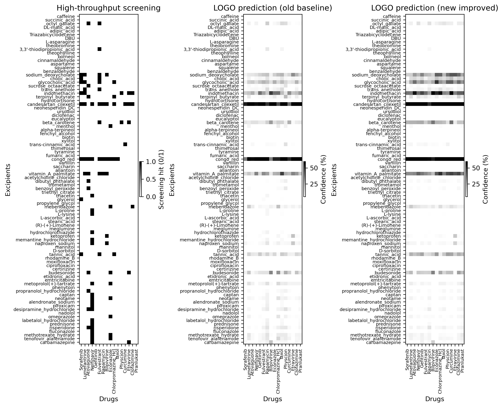
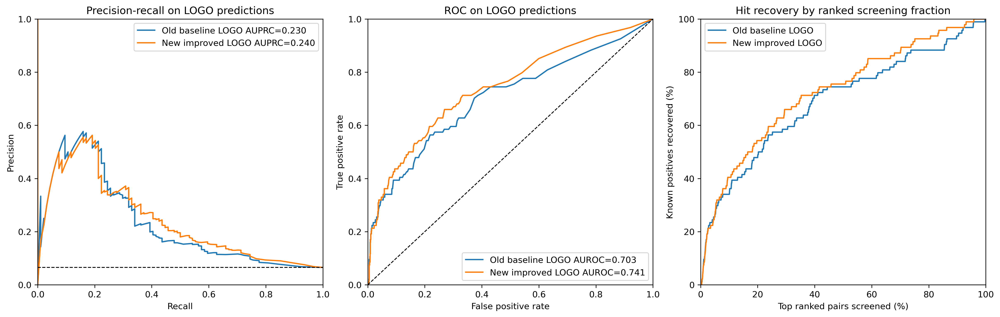

# Project Summary

This repository has two parts.

1. **Baseline reproduction:** reproduce the first paper-inspired pipeline with Morgan fingerprints + RDKit descriptors and a Random Forest.
2. **Improvement study:** run ablations to choose a better model/feature setup for unseen-drug generalization and final screening.

## Paper Reference

Reference paper:

```text
Reker, D., et al. (2021).
Computationally guided high-throughput design of self-assembling drug nanoparticles.
Nature Nanotechnology.
https://doi.org/10.1038/s41565-021-00870-y
```

Paper-reported chemical feature results:

| Validation | Paper setup | MCC | F1 | Precision | Accuracy | AUROC | AUPRC |
| --- | --- | ---: | ---: | ---: | ---: | ---: | ---: |
| 10-fold CV | FP + MD | 0.32 | 0.28 | 0.62 | 0.94 | 0.86 | 0.37 |
| 10-fold CV | Only FP | 0.30 | 0.27 | 0.60 | 0.94 | 0.85 | 0.36 |
| LOGO | FP + MD | 0.28 | 0.26 | 0.55 | 0.94 | 0.71 | 0.23 |
| LOGO | Only FP | 0.26 | 0.26 | 0.55 | 0.89 | 0.70 | 0.22 |

This implementation does not include the paper's molecular dynamics features, so the closest comparison is the chemical-only setting.

## Part 1: Baseline Reproduction

Baseline setup:

- Features: Morgan fingerprint + RDKit descriptors
- Model: Random Forest
- Main scripts: `scripts/train_baseline.py`, `scripts/run_inference.py`
- Main outputs: `results/random_forest/`, `results/inference/`

Baseline LOGO performance:

| Setup | Threshold | AUPRC | MCC | F1 | Precision | Recall | Accuracy | AUROC |
| --- | ---: | ---: | ---: | ---: | ---: | ---: | ---: | ---: |
| Random Forest, Morgan + RDKit | 0.50 | 0.4547 | 0.3066 | 0.2660 | 0.5938 | 0.2160 | 0.9375 | 0.8055 |
| Random Forest, Morgan + RDKit | 0.20 | 0.4547 | 0.2825 | 0.2863 | 0.3326 | 0.3838 | 0.9097 | 0.8055 |

Baseline interpretation:

- Threshold 0.50 is stricter and gives better precision.
- Threshold 0.20 is better for discovery because it raises recall.
- The baseline is strong enough to reproduce the general behavior of the paper-inspired pipeline, but it is not the final recommended model after ablation.

## Earlier Model Comparison

Before the main ablation study, three model families were compared on the baseline Morgan + RDKit representation.

LOGO at threshold 0.50:

| Model | MCC | F1 | Precision | Recall | Accuracy | AUROC | AUPRC |
| --- | ---: | ---: | ---: | ---: | ---: | ---: | ---: |
| Random Forest | 0.3066 | 0.2660 | 0.5938 | 0.2160 | 0.9375 | 0.8055 | 0.4547 |
| ExtraTrees | 0.2946 | 0.2599 | 0.5625 | 0.2077 | 0.9368 | 0.8185 | 0.4802 |
| Logistic Regression | 0.3691 | 0.3366 | 0.6250 | 0.2780 | 0.9403 | 0.8274 | 0.4742 |

This showed two useful patterns:

- Tree ensembles were strong for ranking candidates.
- Logistic Regression was surprisingly strong for thresholded unseen-drug decisions.

## Part 2: Improvement Study

The ablation study tested:

- Stage B: imbalance handling and threshold tuning
- Stage C: molecular representations, including Morgan-only, RDKit-only, Morgan + RDKit, eos2lm8, and ChemBERTa
- Stage E: model families, including Random Forest, ExtraTrees, Logistic Regression, Kernel SVM, XGBoost, LightGBM, and HistGradientBoosting where available

Full details:

- `ablation_study.md`
- `ablation_study_summary.md`
- `results/imbalance/`
- `results/representations/`
- `results/stage_e_models/`

## Final Improved Setups

Two final setups were selected because they answer different questions.

| Use case | Final setup | Threshold | AUPRC | MCC | F1 | Precision | Recall | AUROC |
| --- | --- | ---: | ---: | ---: | ---: | ---: | ---: | ---: |
| Candidate ranking / discovery | Morgan only + class-weighted Random Forest | 0.30 | 0.4858 | 0.3381 | 0.3451 | 0.3926 | 0.4130 | 0.8426 |
| Conservative binary decision | Morgan + ChemBERTa + Logistic Regression | 0.40 | 0.4754 | 0.3691 | 0.3366 | 0.6250 | 0.2780 | 0.8332 |

Recommended use:

- Use **Morgan only + class-weighted Random Forest** for final screening/ranking.
- Use **Morgan + ChemBERTa + Logistic Regression** only when a stricter yes/no decision is more important than ranking.

## Baseline vs Improved

Compared with the baseline Random Forest at threshold 0.50, the final ranking model changed performance as follows:

| Metric | Baseline | Improved ranking | Change |
| --- | ---: | ---: | ---: |
| AUPRC | 0.4547 | 0.4858 | +0.0311 |
| MCC | 0.3066 | 0.3381 | +0.0315 |
| F1 | 0.2660 | 0.3451 | +0.0791 |
| Precision | 0.5938 | 0.3926 | -0.2012 |
| Recall | 0.2160 | 0.4130 | +0.1970 |
| AUROC | 0.8055 | 0.8426 | +0.0371 |

Compared with the same baseline, the conservative improved model changed performance as follows:

| Metric | Baseline | Improved conservative | Change |
| --- | ---: | ---: | ---: |
| AUPRC | 0.4547 | 0.4754 | +0.0207 |
| MCC | 0.3066 | 0.3691 | +0.0625 |
| F1 | 0.2660 | 0.3366 | +0.0706 |
| Precision | 0.5938 | 0.6250 | +0.0312 |
| Recall | 0.2160 | 0.2780 | +0.0620 |
| AUROC | 0.8055 | 0.8332 | +0.0277 |

Interpretation:

- The ranking model is best when the goal is to find promising candidates for follow-up.
- The conservative model is best when false positives are more costly.
- Learned SMILES embeddings helped some thresholded decisions, but they did not beat Morgan-only for candidate ranking.

## Final Model Workflow

Train the final improved discovery model on all labeled data:

```bash
python scripts/train_final_model.py
```

Run final improved screening:

```bash
python scripts/run_final_inference.py
```

Create final LOGO and inference comparison plots:

```bash
python scripts/visualize_final_comparison.py
```

This is the validation-oriented visualization. It uses LOGO predictions on the labeled high-throughput screening matrix. Optional inference diagnostics can be written with:

```bash
python scripts/visualize_final_comparison.py --include-inference-diagnostics
```

Those inference diagnostics are not validation metrics because the large inference pool has no labels.

Expected new outputs:

- `results/final_model/improved_morgan_rf_model.pkl`
- `results/final_model/improved_morgan_rf_metadata.json`
- `results/final_inference/improved_all_pair_scores.csv`
- `results/final_inference/improved_predicted_nanoparticle_candidates.csv`
- `results/final_validation_visualizations/`

Main validation visualization files:

- `heatmap_logo_actual_old_new_style.png`
- `logo_validation_curves_old_vs_new.png`

LOGO heatmap comparison:

<p align="center">
  
</p>

LOGO validation curves:

<p align="center">
  
</p>

The old baseline scripts still work separately:

```bash
python scripts/train_baseline.py
python scripts/run_inference.py
```

## Not Done / Future Work

- Molecular dynamics features from the original paper were not added.
- 3D RDKit descriptors were not included in the main ablation.
- UniMAP was skipped because the available repository/checkpoint path was not usable.
- Graph neural networks were left as future work because they require a separate graph-data pipeline.
- Calibration could be added later if probability values need to be interpreted as calibrated probabilities rather than ranking scores.
